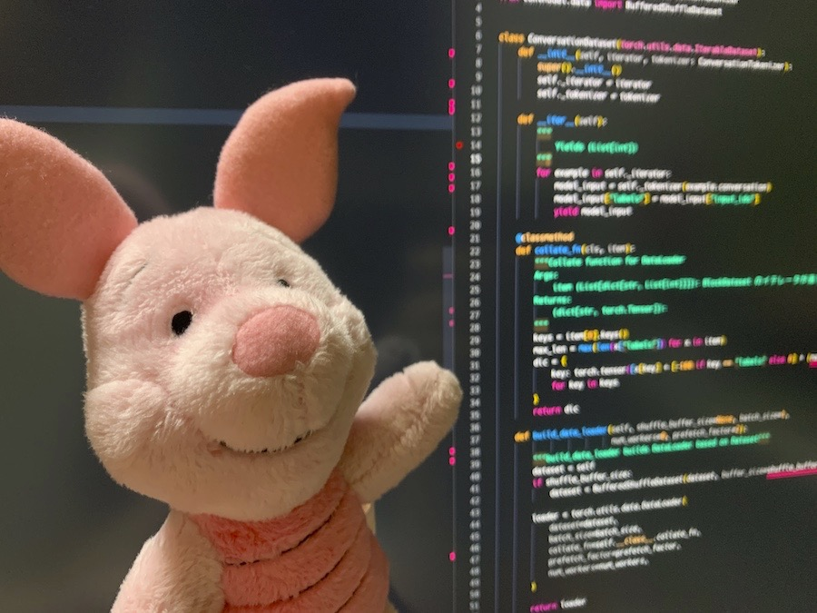

# 会話学習・応答生成フレームワーク convmodel を作成しました

カラフルスコップ研究室に出向で来たぽじぶーちゃんの初めの仕事は、研究室の実験で皆が使っている会話モデルを使いやすくするためにフレームワーク化することでした。

開発も一段落しましたので、今回はぽじぶーちゃんから作成したフレームワーク convmodel のチュートリアルを行ってもらおうと思います。



## 概要

今回は生成アプローチの会話モデルのフレームワーク convmodel を作成しました。

ここでは、フレームワークの詳細に移る前に会話システムの概要を話したいと思います。

一般的な会話システムでよくある手法は、事前に入力発話に対する応答を用意しておく方法です。
この手法のメリットの一つは、作成者が設計した会話フロー通りに動くことを保証でき、作成した応答以外返さないようにできる点です。
このメリットは非常に大きく、特に企業では意図しない応答をしてはならないケースがほとんどなため、企業が提供するチャットボットでは重宝します。

**ノート:** ぽじぶーちゃんは企業から出向してきているので企業事情に明るいです。

一方で、会話の流れというのは実に様々であるため、あらかじめどのような発話がくるかを予測して応答を準備しておくというのは難しいものです。

これを克服するために、応答文をその場で生成するアプローチがあります。
特に近年のTransformerを使ったアプローチでは精度よく文章生成が可能になってきていることもあり、この生成アプローチを採用するシステムもだんだんと出てきています。
ただし、生成アプローチは意図していない回答を返してしまう可能性もあるため、企業では依然として採用を見送るのが一般的なようです。

convmodelは、生成アプローチを採用した会話モデルを提供しています。
具体的には、GPT-2 といった [transformers](https://github.com/huggingface/transformers) が提供している
[デコーダモデル](https://huggingface.co/transformers/model_summary.html#decoders-or-autoregressive-models)をファインチューニングすることで会話モデルを学習します。
convmodelはマルチターンの会話に対応しており、学習・応答生成のための便利なインターフェースを提供しています。

それでは以下で convmodel について見ていきましょう。

## インストール

まずはconvmodelをインストールしておきたいと思います。
インストールには二つのステップが必要です。

一つ目のステップでは、PyTorchをインストールします。
[PyTorch公式ドキュメント](https://pytorch.org/get-started/locally/)
に従ってご自身の環境に合わせて PyTorch をインストールします。

Colorful Scoop の環境は Linux, CUDA 11.1 なので以下の方法でインストールを行いました。

```sh
$ pip install torch==1.8.1+cu111 -f https://download.pytorch.org/whl/torch_stable.html
```

PyTorchがインストールできたら、convmodelをインストールします。
今回は最新のバージョンの 0.3.0 をインストールします。

```sh
$ pip install convmodel==0.3.0
```

Dockerを用いた環境構築方法を[ドキュメント](https://colorfulscoop.github.io/convmodel-docs/install/)に記載してあるので、確認してみてください。

## モデルのアーキテクチャ

簡単に convmodel のアーキテクチャを見ておきましょう。
convmodelでは[デコーダモデル](https://huggingface.co/transformers/model_summary.html#decoders-or-autoregressive-models)を会話モデルに採用しており、会話中の発話を `sep_token` を使って区切ることでマルチターンの会話の学習が可能になっています。

会話のトークン化と `sep_token` による区切りの処理 `convmodel.ConversationTokenizer` が担ってくれています。
実際に動かして確認してみましょう。

まずは学習済みモデルからトークナイザをロードします。
デコーダモデルであればどの学習済みモデルからで問題ないですが、今回は Colorful Scoop が提供している
日本語Wikipediaで学習したGPT-2モデルの
[colorfulscoop/gpt2-small-ja](https://huggingface.co/colorfulscoop/gpt2-small-ja)
を使いたいと思います。


```python
from convmodel import ConversationTokenizer
tokenizer = ConversationTokenizer.from_pretrained("colorfulscoop/gpt2-small-ja")
```

トークナイザは発話のリストとして会話を引数に受け取ると、その中の発話をトークナイズし、`sep_token` で連結します。


```python
tokenizer.sep_token, tokenizer.sep_token_id
```


    ('<sep>', 5)


```python
tokenizer(["おはよう", "おはよう。調子は？", "いいです"])
```


    {'input_ids': [5, 23450, 5, 23450, 7, 14784, 9, 3300, 5, 2736, 2191, 5],
     'token_type_ids': [0, 0, 1, 1, 1, 1, 1, 1, 0, 0, 0, 1],
     'attention_mask': [1, 1, 1, 1, 1, 1, 1, 1, 1, 1, 1, 1]}


`input_ids` に、各発話をトークン化した結果のidが入っています。
表にまとめると次のようになります。

| position | 0 | 1 | 2 | 3 | 4 | 5 | 6 | 7 | 8 | 9 | 10 | 11 |
| --- | --- | --- | --- | --- | --- | --- | --- | --- | --- | --- | --- | --- |
| word | <sep\> | おはよう | <sep\> | おはよう | 。 | 調子 | は | ？ | <sep\> | いい | です | <sep\> |
| input_ids | 5 | 23450 | 5 | 23450 | 7 | 14784 | 9 | 3300 | 5 | 2736 | 2191 | 5 |
| token_type_ids | 0 | 0 | 1 | 1 | 1 | 1 | 1 | 1 | 0 | 0 | 0 | 1 |
| attention_mask | 1 | 1 | 1 | 1 | 1 | 1 | 1 | 1 | 1 | 1 | 1 | 1 |

結果を見ると `input_ids` の他に `token_type_ids` というのがあることがわかります。
`token_type_ids` は、各発話の話者がわかるようにidをふっています。初めに話し始める話者を `0`, それに応答する話者を `1` として順にidを振っていきます。
`token_type_ids`の説明は[transformersドキュメント](https://huggingface.co/transformers/glossary.html#token-type-ids)にもあるので参考にしてください。

`attention_mask` は、アテンションを当てる位置を指定するために用います。全てのトークンにアテンションを当てるため全て `1` を設定しています。

convmodel はこのトークナイザの結果をデコーダモデルに入力して、次の単語を当てるように学習を行います。

ここではトークナイザの説明をしましたが、実際にconvmodelを使って学習・応答生成を行う際には
トークナイズするコードを自分で書く必要はありません。
詳しくは次の「モデル学習」でみていきましょう。

## モデル学習

モデル学習には大きく三つのステップが必要になります。

1. 学習データの準備
2. モデルの初期化
3. 学習の実行

順番に見ていきましょう。

### 1. 学習データの準備

convmodelでは学習データは、会話を `ConversaitonExample` でラップして、リストなどのイテレータとして用意します。
具体的に小さな例を見てみましょう。


```python
from convmodel import ConversationExample

data_iterator = [
    ConversationExample(conversation=["おはよう", "おはよう。調子は？", "いいです"]),
    ConversationExample(conversation=["こんにちは", "こんにちは、お昼食べた？", "もう食べました"]),
]
```

このような形で `ConversationExample` オブジェクトで各会話をラップしてイテレータとして用意します。

今回のような小さなデータではリストとして用意すればいいのですが、何千・何億といったデータサイズになってくるとメモリにはのらない状況になります。
その際には、会話データはファイルとして用意し、一行ずつ読み込んでデータを提要するような実装をすることになります。
ここではこの実装を行ってみましょう。

データは次のような各行がひとつの会話からなる [JSON Lines](https://jsonlines.org/) 形式で用意するとします。

```json
["おはよう", "おはよう。調子は？", "いいです"]
["こんにちは", "こんにちは、お昼食べた？", "もう食べました"]
```

このデータを `data.jsonl` として保存しておきます。

このファイルを一行ずつ読み込み、`ConversationExample`オブジェクトでラップして返すイテレータクラスが次になります。


```python
import json

class JsonLinesIterator:
    """Json Lines data loader used in fit command"""
    def __init__(self, filename: str):
        self._filename = filename

    def __iter__(self):
        with open(self._filename) as fd:
            for line in fd:
                yield ConversationExample(conversation=json.loads(line))
```

実際に使ってみましょう。サンプルデータ `data.jsonl` をロードしてみます。


```python
iterator = JsonLinesIterator("data.jsonl")
```

ループで各発話を表示してみます。


```python
for example in iterator:
    print(example)
```

    conversation=['おはよう', 'おはよう。調子は？', 'いいです']
    conversation=['こんにちは', 'こんにちは、お昼食べた？', 'もう食べました']


うまく動いているようですね！

では、次は実際に学習に使うデータセットからイテレータオブジェクトを準備しておきましょう。
今回はColorful Scoopが所有する約1400万のマルチターンの会話データを使うことにします。
ここから50万会話をバリデーションとテスト用に切り出しておきます。
最終的には次のような学習ファイルを先程の JSON Lines フォーマットで準備します。

| ファイル名 | データサイズ
| --- | --- |
| train.jsonl | 1300万会話 |
| valid.jsonl | 50万会話 |
| test.jsonl | 50万会話 |


ファイルの準備ができたらイテレータを作成します。


```python
train_iterator = JsonLinesIterator("train.jsonl")
valid_iterator = JsonLinesIterator("valid.jsonl")
test_iterator = JsonLinesIterator("test.jsonl")
```

### モデルの初期化

学習データの準備ができたら、学習に使うモデルを初期化します。
トークナイザの時と同様、デコーダモデルであればどの学習済みモデルでも問題ないですが、
ここでもColorful Scoopが提供しているモデル
[colorfulscoop/gpt2-small-ja](https://huggingface.co/colorfulscoop/gpt2-small-ja)
を使いたいと思います。


```python
from convmodel import ConversationModel

model = ConversationModel.from_pretrained("colorfulscoop/gpt2-small-ja")
```

チュートリアルのはじめでトークナイザ `ConversationTokenizer` の説明をしましたが、それは内部の挙動を説明するためでした。
実際には、トークナイザは `ConversationModel` の中で初期化されて必要に応じて会話をトークナイズしてくれますので、
convmodelを使う中でトークナイザを直接利用する必要はありません。

さて、モデルを初期化できましたので、学習の仕方を見ていきましょう。

### 学習の実行

学習には `ConversationModel.fit` メソッドを使います。
学習に必須の引数は、学習・検証データとなります。
次のように `fit` メソッドの `train_iterator` と `valid_iterator` 引数に先程定義したイテレータを渡すことで学習を行えます。

```py
model.fit(train_iterator=train_iterator, valid_iterator=valid_iterator)
```

これでも学習できるのですが、ここでは便利なオプション `output_path` と `save_best_model` も指定したいと思います。

* `output_path` を指定することで学習したモデルをエポックの終わりに指定したディレクトリ以下に保存するようになります。
これにより、学習途中でもモデルを試すことができます。
* `output_path` とともに `save_best_model=True` を指定すると、バリデーションデータに対してパープレキシティの意味で最も性能のよいモデルを保存します。

これらのオプションを指定して学習を実行してみましょう。
下の例ではさらにいくつかオプションを指定しています。各オプションの意味はコメントを参考にしてください。

```py
model.fit(
    train_iterator=train_iterator,
    valid_iterator=valid_iterator,
    output_path="model",
    save_best_model=True,
    # 学習率を初めの10,000ステップで0から線形に増加させる
    warmup_steps=10000,
    # Mixed precisoinを使う
    use_amp=True,
    # 学習エポック数
    epochs=5,
    # バッチサイズ
    batch_size=16,
    # 何バッチごとにパラメータを更新するかの設定。
    # この設定では 16*4 = 64 サンプルごとにパラメータ更新することになる
    accumulation_steps=4,
    # 学習データをシャッフルするバッファサイズ
    shuffle_buffer_size=100000,
    # シード
    seed=1000,
)
```

実行時のログは以下のようになります。少し長いので最後のバリデーションの結果のみ表示します。

```
...
{'epoch': 5, 'valid_loss': 3.288458056575775, 'valid_ppl': 26.801505373057534, 'save_model': True}
```

学習が完了すると `output_path` で指定したディレクトリ以下にモデルが保存されていることが確認できます。


```python
!ls -1 model
```

    config.json
    pytorch_model.bin
    special_tokens_map.json
    spiece.model
    tokenizer_config.json


## 評価

モデルが学習できたらテストセットで評価してみましょう。

まずは学習したモデルをロードします。
ロードにはモデル初期化時と同じ ConversationModel.from_pretrained メソッドを使います。
ただし、今回は学習モデルを保存したディレクトリを指定します。


```python
model = ConversationModel.from_pretrained("model")
```

モデルがロードできたら、評価には `ConversationModel.eval` メソッドでモデルを評価します。

```py
model.eval(eval_iterator=test_iterator, batch_size=16)
```

評価が完了すると評価結果のパープレキシティが表示されます。

```
```

## 応答生成

モデルが学習できたら、応答を生成してみましょう。

応答の生成には `ConversationModel.generate` メソッドを使います。
引数の `context` に会話のコンテキストを指定します。

`generate` メソッドには transformers の [generate](https://huggingface.co/transformers/main_classes/model.html?highlight=generate#transformers.generation_utils.GenerationMixin.generate) メソッドの任意のパラメータを指定できます。
ここでは `do_sample`, `top_p`, `top_k` を指定してみます。
これらのオプションについては [Hugging Face ブログ](https://huggingface.co/blog/how-to-generate) に詳しい説明があるので一度読んでみることをお勧めします。

`generate` メソッドはコンテキストとオプションが渡されると、`sep_token` が現れるまで順次トークンを生成していきます。

では実際に生成してみましょう。


```python
model.generate(
    context=["おはよう", "おはよう。調子は？", "いいです"],
    do_sample=True,
    top_p=0.95,
    top_k=50,
    max_length=1024,
)
```


    ConversationModelOutput(responses=['なら良かった....。'], context=['おはよう', 'おはよう。調子は？', 'いいです'])


結果は `ConversationModelOutput` オブジェクトとして返ってきます。
`responses` 属性にアクセスすることで応答文を取り出すことができます。

また `num_return_sequences` を指定することで複数の応答文を生成することも可能です。
試してみましょう。


```python
model.generate(
    context=["おはよう", "おはよう。調子は？", "いいです"],
    do_sample=True,
    top_p=0.95,
    top_k=50,
    max_length=1024,
    num_return_sequences=3
)
```


    ConversationModelOutput(responses=['なら良かったよ。じゃ、今度通話する?', 'ならよかった', '今日はどうするの?'], context=['おはよう', 'おはよう。調子は？', 'いいです'])


## まとめ

ここまでで convmodel のチュートリアルは終了となります。
最後にまとめておきましょう。

convmodelは生成アプローチによる会話モデルのフレームワークで [transformers](https://github.com/huggingface/transformers) の
[デコーダモデル](https://huggingface.co/transformers/model_summary.html#decoders-or-autoregressive-models)をモデルとして使い、便利な学習・応答生成インターフェースを提供します。

現時点では実験的な機能ですが、学習・評価・トライのループを補助する [convmodel CLI](https://colorfulscoop.github.io/convmodel-docs/cli/) も実装しています。

convmodeのコードとドキュメントは以下からどうぞ。

* [GitHub](https://github.com/colorfulscoop/convmodel)
* [ドキュメント(英語)](https://colorfulscoop.github.io/convmodel-docs/)

さて、ぽじぶーちゃんはここ最近働きづめだったので、しばらく休憩をとりに行くのでした。


